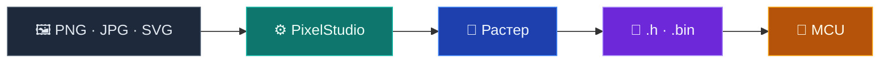

<div align="center">


# PixelStudio

### Изображение → прошивочный код за минуты

Десктопная студия для конвертации картинок в C/C++ массивы и бинарные форматы.<br/>
OLED, TFT, E-paper — без ручной рутины с hex-дампами.

<br/>

[](https://github.com/DeeTech-Labs/PixelStudio/releases)
[](docs/building.md)
[](CONTRIBUTING.md)

<br/>

[](https://github.com/DeeTech-Labs/PixelStudio/stargazers)
[](https://github.com/DeeTech-Labs/PixelStudio/releases)
[](https://github.com/DeeTech-Labs/PixelStudio/actions/workflows/build.yml)
[](LICENSE)
[](https://www.qt.io/)
[](https://isocpp.org/)

</div>

> [!TIP]
>
> <table>
> <tr>
> <td valign="middle">
> <h3><a href="Funding.md">🎉 Поддержать проект</a></h3>
> <p><strong><a href="https://www.donationalerts.com/r/deexsed">DonationAlerts</a></strong> — в сообщении к донату можно написать пожелания по доработкам.</p>
> </td>
> <td valign="middle" align="right" width="140">
> <a href="https://www.donationalerts.com/r/deexsed"></a>
> </td>
> </tr>
> </table>


*Студия — превью в реальном времени, инспектор параметров, экспорт в один клик*

## Возможности

<table>
<tr>
<td width="50%" valign="top">

**Растеризация под экран**

Масштаб, кроп, фильтры и дизеринг — результат сразу виден в превью.

**Профили дисплея**

Mono 1-bpp, RGB565, indexed palette, пресеты Icon / Splash / E-paper.

**Генерация кода**

Заголовки C/C++, раскладка под PROGMEM, анализ кодирования.

</td>
<td width="50%" valign="top">

**Экспорт без рутины**

Пакетный экспорт, спрайт-атлас, бинарный дамп, watch folder.

**Проекты и сессии**

Сохранение настроек студии, вкладок и параметров экспорта.

**Локализация**

Русский и английский из коробки; свои языки через JSON в AppData.

</td>
</tr>
</table>

## Как это работает



## Форматы пикселей

| Формат | Применение | Дисплей |
|:-------|:-----------|:--------|
| **1-bpp mono** | Иконки, статус-бары | SSD1306 OLED |
| **RGB565** | Цветной UI, сплэши | ILI9341 TFT |
| **Indexed 4/8-bit** | Спрайты, tilemaps | Game Boy-style |
| **Custom palette** | Брендовые цвета | Любой fixed-palette |

## Быстрый старт

1. Скачайте [`PixelStudio-Setup-*.exe`](https://github.com/DeeTech-Labs/PixelStudio/releases) из релизов GitHub.
2. Установите и откройте приложение.
3. Перетащите изображение → выберите профиль → экспортируйте `.h`.

SHA256 установщика — в описании [релиза](https://github.com/DeeTech-Labs/PixelStudio/releases).

> Установщик не подписан Authenticode — Windows SmartScreen может запросить подтверждение при первом запуске.

## Пример выхода

Фрагмент `.h` для OLED 128×64 (mono, SSD1306):

```c
// Icon — 128×64
// Layout: vertical page buffer (SSD1306)

#define ICON_LOGO_WIDTH  128
#define ICON_LOGO_HEIGHT 64
static const uint8_t icon_logo[] PROGMEM = {
    0x00, 0x00, 0x00, 0x00, 0x3C, 0x00, 0x42, 0x00,
    0x81, 0x00, 0x81, 0x00, 0x42, 0x00, 0x3C, 0x00,
    /* … */
};
```


*Приветствие — недавние проекты и быстрый старт*

## Для разработчиков

<table>
<tr>
<td width="33%" align="center">

[**Сборка**](docs/building.md)

CMake · Qt 6.8 · Ninja

</td>
<td width="33%" align="center">

[**Участие**](CONTRIBUTING.md)

PR · стиль · переводы

</td>
<td width="33%" align="center">

[**Журнал изменений**](CHANGELOG.md)

История версий

</td>
</tr>
</table>

```
PixelStudio/
├── src/
│   ├── processing/   растер, палитры, codegen
│   ├── export/       пакетный экспорт, атлас, watch folder
│   └── persistence/  проекты и настройки
├── translations/     RU · EN (+ переопределения в AppData)
└── installer/        Inno Setup, CI pipeline
```

Qt 6.8 Quick · C++17 · CMake · GitHub Actions

## Сообщество

| | |
|:--|:--|
| [Сообщить об ошибке](https://github.com/DeeTech-Labs/PixelStudio/issues/new?template=bug_report.yml) | Баг с картинкой? Приложите PNG и профиль дисплея — разберём быстрее |
| [Предложить улучшение](https://github.com/DeeTech-Labs/PixelStudio/issues/new?template=feature_request.yml) | Опишите дисплей и контроллер (SSD1306, ILI9341…) |
| Уязвимости | [SECURITY.md](SECURITY.md) — private advisory |
| Кодекс | [CODE_OF_CONDUCT.md](CODE_OF_CONDUCT.md) |

> При баг-репорте: логи в **Настройки → Данные → Открыть папку логов**.

## Благодарность сообществу

PixelStudio развивается благодаря всем, кто сообщает об ошибках, предлагает идеи и присылает pull request'ы.

[](https://github.com/DeeTech-Labs/PixelStudio/graphs/contributors)

Хотите попасть в этот список? См. [руководство для участников](CONTRIBUTING.md).

Если PixelStudio полезен — поставьте ⭐ репозиторию.

[](https://star-history.com/#DeeTech-Labs/PixelStudio&Date)

---

**[MIT License](LICENSE)** · [NOTICE.txt](NOTICE.txt)

*Сделано на Qt · Windows x64*
