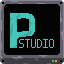
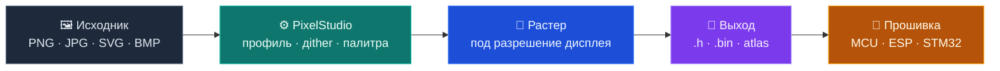
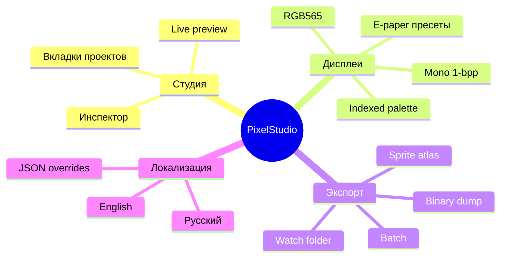
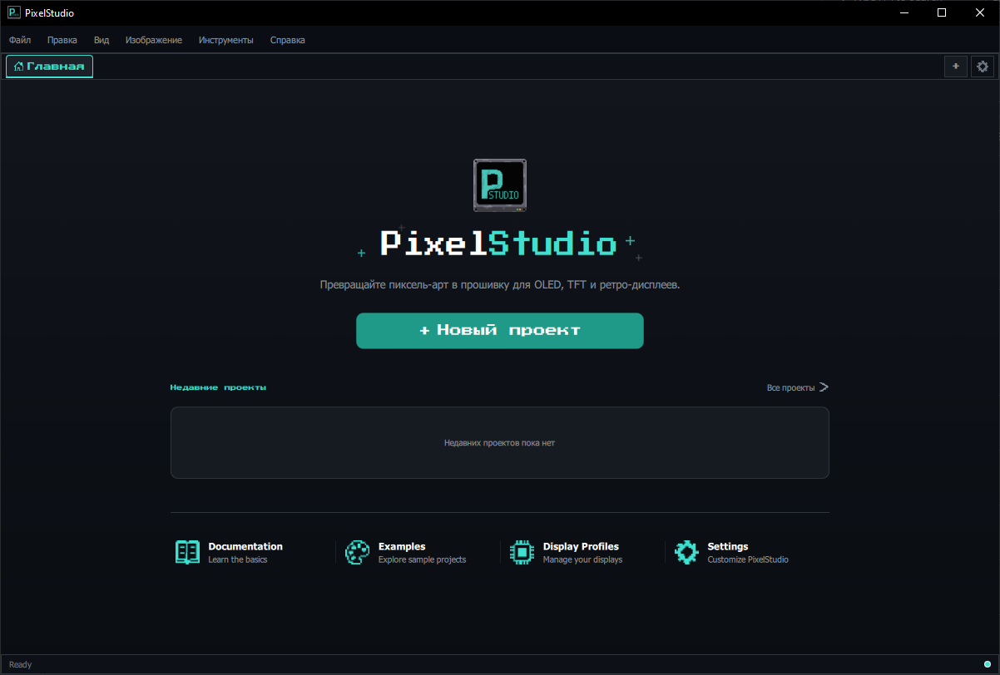
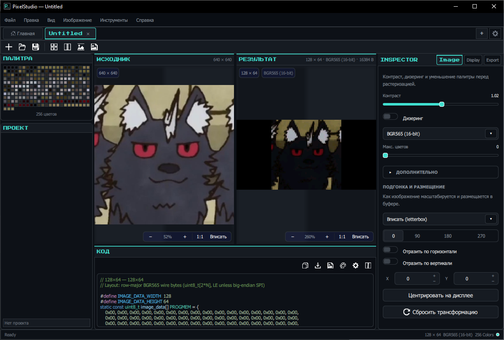
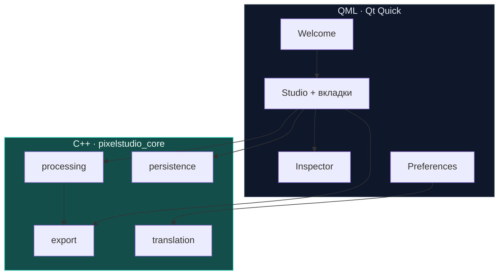

<div align="center">



# PixelStudio

**Изображение → прошивочный код за минуты**

Десктопная студия для конвертации картинок в C/C++ массивы и бинарные форматы под OLED, TFT и другие embedded-дисплеи.

[](https://github.com/DeeTech-Labs/PixelStudio/actions/workflows/build.yml)
[](https://github.com/DeeTech-Labs/PixelStudio/releases)
[](LICENSE)
[](https://www.qt.io/)
[](https://github.com/DeeTech-Labs/PixelStudio/releases)
[](https://isocpp.org/)

[**Скачать установщик**](https://github.com/DeeTech-Labs/PixelStudio/releases) ·
[**Сборка**](docs/building.md) ·
[**Issues**](https://github.com/DeeTech-Labs/PixelStudio/issues) ·
[**Contributing**](CONTRIBUTING.md)

</div>

---

## Как это работает



<table>
<tr>
<td width="50%" valign="top">

### Вход
- Drag-and-drop и watch folder
- Импорт существующих `.h`
- Пакетная обработка папок

</td>
<td width="50%" valign="top">

### Выход
- C/C++ заголовки с массивами
- Бинарные дампы для flash
- Sprite atlas и batch export

</td>
</tr>
</table>

---

## Возможности



<table>
<tr>
<td align="center" width="25%">
<h3>🎨</h3>
<b>Растеризация</b><br/>
<sub>Масштаб, кроп, фильтры, dithering под конкретный экран</sub>
</td>
<td align="center" width="25%">
<h3>📟</h3>
<b>Профили дисплея</b><br/>
<sub>OLED/TFT: mono, RGB565, indexed — пресеты Icon, Splash, E-paper</sub>
</td>
<td align="center" width="25%">
<h3>🧩</h3>
<b>Генерация кода</b><br/>
<sub>Анализ кодирования, C/C++ headers, PROGMEM-friendly layout</sub>
</td>
<td align="center" width="25%">
<h3>📦</h3>
<b>Экспорт</b><br/>
<sub>Batch, atlas, binary, watch folder — без ручной рутины</sub>
</td>
</tr>
<tr>
<td align="center">
<h3>💾</h3>
<b>Проекты</b><br/>
<sub>Сохранение сессий студии и настроек экспорта</sub>
</td>
<td align="center">
<h3>🔍</h3>
<b>Инспектор</b><br/>
<sub>Image · Display · Export — всё в одной панели</sub>
</td>
<td align="center">
<h3>🌐</h3>
<b>Переводы</b><br/>
<sub>RU/EN из коробки; свои языки через JSON в AppData</sub>
</td>
<td align="center">
<h3>🪟</h3>
<b>Windows installer</b><br/>
<sub>Inno Setup, CI-сборка, SHA256 в описании релиза</sub>
</td>
</tr>
</table>

### Поддерживаемые форматы пикселей

| Формат | Типичное применение | Пример дисплея |
|--------|---------------------|----------------|
| **1-bpp mono** | Иконки, статус-бары | SSD1306 OLED |
| **RGB565** | Цветной UI, сплэши | ILI9341 TFT |
| **Indexed 4/8-bit** | Спрайты, tilemaps | Game Boy-style |
| **Custom palette** | Брендовые цвета | Любой fixed-palette |

---

## Скриншоты

<table>
<tr>
<td width="50%"></td>
<td width="50%"></td>
</tr>
<tr>
<td align="center"><sub>Welcome — старт и недавние проекты</sub></td>
<td align="center"><sub>Studio — превью, инспектор, экспорт</sub></td>
</tr>
</table>

---

## Скачать

| | |
|---|---|
| **Windows x64** | [`PixelStudio-Setup-*.exe`](https://github.com/DeeTech-Labs/PixelStudio/releases) |
| **Проверка** | SHA256-сумма в описании [релиза](https://github.com/DeeTech-Labs/PixelStudio/releases) |
| **Исходники** | Этот репозиторий + [инструкция по сборке](docs/building.md) |

---

## Быстрый старт

### Установка (пользователь)

1. Скачайте `PixelStudio-Setup-*.exe` из [Releases](https://github.com/DeeTech-Labs/PixelStudio/releases).
2. Запустите установщик → откройте PixelStudio.
3. Перетащите изображение → выберите профиль дисплея → экспортируйте `.h`.

### Сборка (разработчик)

<details>
<summary><b>CMake + Ninja</b> — развернуть</summary>

```powershell
$qt = "C:\Qt6\6.8.2\msvc2022_64"

cmake -S . -B build\Release -G Ninja `
  -DCMAKE_BUILD_TYPE=Release `
  -DCMAKE_PREFIX_PATH="$qt"

cmake --build build\Release
```

Запуск: `build\Release\PixelStudio.exe`  
Перед распространением: `windeployqt` — см. [docs/building.md](docs/building.md).

</details>

<details>
<summary><b>Установщик Inno Setup</b> — развернуть</summary>

```powershell
.\installer\build-installer.ps1 -QtDir "C:\Qt6\6.8.2\msvc2022_64"
# → installer\output\PixelStudio-Setup-<версия>.exe
```

Версия: [`cmake/PixelStudioVersion.cmake`](cmake/PixelStudioVersion.cmake).

</details>

---

## Архитектура



```
PixelStudio/
├── cmake/           Версия и CMake-модули
├── src/             C++ ядро + QML UI
│   ├── processing/  Растер, палитры, codegen
│   ├── export/      Batch, atlas, watch folder
│   └── persistence/ Проекты и настройки
├── translations/    en.json · ru.json (+ AppData overrides)
├── resources/       Иконки и ассеты
├── installer/       Inno Setup + CI pipeline
└── docs/            Сборка, версионирование
```

---

## Стек

| Слой | Технологии |
|------|------------|
| UI | Qt 6.8 Quick, Quick Controls 2, QML |
| Core | C++17, CMake, Ninja / MSVC 2022 |
| i18n | JSON bundles, runtime overrides |
| Packaging | windeployqt, Inno Setup 6 |
| CI/CD | GitHub Actions — `build.yml`, `release.yml` |

---

## Участие

Нашли баг или есть идея? → [**Issues**](https://github.com/DeeTech-Labs/PixelStudio/issues)  
Хотите внести код? → [**CONTRIBUTING.md**](CONTRIBUTING.md)  
Уязвимость? → [**SECURITY.md**](SECURITY.md) · private advisory

---

<div align="center">

**[MIT](LICENSE)** · [NOTICE.txt](NOTICE.txt) (Qt и сторонние компоненты)

</div>
